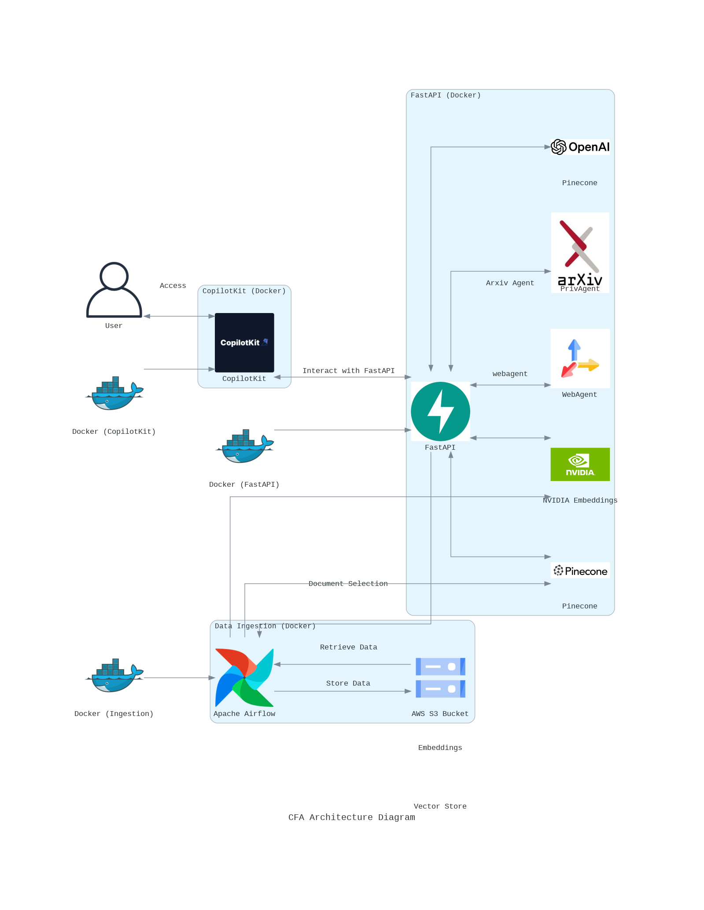

# Assignment4

# AI-Powered Research Tool Documentation

## Project Resources
- Copolit App link (hosted on GCP): 
- Airflow Link (hosted on GCP): 
- FastAPI Link (hosted on GCP): 
- Demo Video URL: [Project Demo]()
- Google Codelabs: [Codelabs](https://codelabs-preview.appspot.com/?file_id=1uiqzGhuxnrQjMPBM3qMWyLu2PDQk0fb3b7AS80Es128#0)

## Goal of the Project
This project builds an end-to-end research tool that combines document processing, vector storage, and multi-agent interactions to create an intelligent research assistant. The system uses Airflow for pipeline orchestration, Pinecone for vector storage, and Langraph for multi-agent coordination.

## Project Overview
The system processes documents using Docling, stores vectors in Pinecone, and provides an interactive research interface powered by multiple AI agents. Users can conduct document-based research, access relevant papers through Arxiv, perform web searches, and generate comprehensive research reports.

## Key Technologies Involved
- **Docling**: Document parsing and structuring
- **Pinecone**: Vector database for semantic search and retrieval
- **Langraph**: Multi-agent system orchestration
- **Airflow**: Pipeline automation and task orchestration
- **Streamlit**: User interface for research interactions
- **FastAPI**: Backend API services
- **Arxiv API**: Academic paper search and retrieval
- **Web Search API**: Broader context research capabilities
- **RAG**: Retrieval-augmented generation for document Q&A

## System Architecture


## System Workflow
1. **Document Processing Pipeline**
   - Airflow orchestrates document ingestion
   - Docling parses and structures documents
   - Vectors are stored in Pinecone

2. **Multi-Agent Research System**
   - Langraph coordinates multiple research agents
   - Arxiv agent searches academic papers
   - Web search agent provides broader context
   - RAG agent handles document-specific queries

3. **User Interaction**
   - Interface for document selection
   - Support for 5-6 questions per document
   - Research session tracking
   - Export capabilities for reports and Codelabs

## Project Structure
```
agent/
│ 
├── research_canvas/
│   ├── agent.py            #ArxivSearchTool, WebSearchTool, RAGSystem, SavePDFTool implementation
│   ├── __init__.py
│   ├── state.py            # AgentState management
│   ├── model.py            # Model configurations
│   └── download.py         # Resource downloading utilities
│
├── chat_outputs/           # Directory for markdown outputs
│   └── *.md               # Chat history markdown files
│
├── reports/               # Directory for PDF reports
│   └── *.pdf             # Generated PDF reports
│
├── config/
│   ├── __init__.py
│   └── settings.py        # Environment and API configurations
│
└── chat/
    ├── __init__.py
    └── chat_node.py       # Main chat implementation
```

## Prerequisites
- Docker and Docker Compose
- Python 3.8+
- GCP account
- Pinecone API key
- OpenAI API key (for RAG)

## Environment Setup
Each component requires specific environment variables:

1. **Airflow**: `airflow/.env`
```env
AIRFLOW_UID=50000
AIRFLOW_GID=50000
_AIRFLOW_WWW_USER_USERNAME=admin
_AIRFLOW_WWW_USER_PASSWORD=admin
```

2. **Backend**: `backend/.env`
```env
PINECONE_API_KEY=your_key
OPENAI_API_KEY=your_key
ARXIV_EMAIL=your_email
```

3. **Frontend**: `frontend/.env`
```env
BACKEND_URL=http://backend:8000
```

## Installation Steps
1. Clone the repository:
```bash
git clone https://github.com/your-username/research-tool
cd research-tool
```

2. Start Airflow:
```bash
cd airflow
docker compose up -d
```

3. Start the application:
```bash
docker compose up --build -d
```

4. Access the application:
- Research Interface: http://localhost:8501
- Airflow Dashboard: http://localhost:8080
- Backend API: http://localhost:8000

## Usage Guide
1. **Document Research**
   - Select a document from the processed collection
   - Ask up to 6 research questions
   - View responses from multiple agents

2. **Export Options**
   - Generate PDF research reports
   - Export findings in Codelabs format

## Deployment
The system is deployed on Google Cloud Platform using Docker containers:
1. Set up GCP project
2. Configure GCP credentials
3. Deploy using Cloud Run or GKE

## Contributors
- Developer 1: Pipeline Development & Document Processing
- Developer 2: Multi-Agent System & Integration
- Developer 3: Frontend & Export Functionality

## Additional Notes
| Name                            | Percentage Contribution |
| ------------------------------- | ----------------------- |
| Sarthak Somvanshi               | 33.33% |
| Yuga Kanse                      | 33.33% |
| Tanvi Inchanalkar               | 33.33% |
WE ATTEST THAT WE HAVEN'T USED ANY OTHER STUDENTS' WORK IN OUR ASSIGNMENT AND ABIDE BY THE POLICIES LISTED IN THE STUDENT HANDBOOK.
